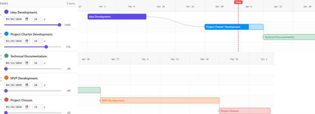

# Stage2 Report - Project: Ammar Platform (عمار) 🏗️

---

## 1. Project Objectives

### Purpose:
To create a centralized digital platform that simplifies how users find trusted construction companies, engineering consultants, and technical workers within a specific city, while improving provider discovery, service booking, and request management.

### Objectives:
- Build user trust in service providers by offering verified company profiles, customer reviews, rating systems, and trust badges that help users make confident decisions before booking.  
- Make it easy for users to quickly find the right company through smart search, clear service categories, filtering options, comparison features, and organized provider profiles.  
- Provide a transparent lifecycle tracking system that allows users to submit service requests, monitor every progress stage (submitted, accepted, in progress, completed).  

---

## 2. Stakeholders and Team Roles

### Stakeholders

| Stakeholder Type | Stakeholder | Role / Interest in Project |
|------------------|------------|---------------------------|
| Internal | Team Members | Responsible for planning, designing, developing, documenting, and testing the MVP. |
| Internal | Course Instructor / Mentor | Provides guidance, feedback, and evaluation of project progress. |
| External | Homeowners / Customers | Primary users who need construction or maintenance services. |
| External | Construction Companies | Service providers who receive booking requests and manage consultations. |
| External | Technicians | Workers such as electricians, plumbers, and repair technicians who provide maintenance services. |

**Table 1: Stakeholder Roles**

---

### Team Roles

| Team Member | Role | Responsibilities |
|-------------|------|------------------|
| Sara Almawkili | Frontend Developer & UI/UX Support | Designs wireframes, develops frontend screens, improves usability, and tests UI workflows. |
| Roya Alahmari | Business Analyst, Research Lead & Project Manager | Conducts user research, validates business needs, manages project planning and task tracking, supports feature prioritization, coordinates team progress, ensures scope alignment, and helps validate usability. |
| Ghalyah Alotaibi | Backend, Security & Database Implementation | Develops backend logic, APIs, authentication, database schema implementation, and secures user data. |
| Rateel Bahathek | System Analysis, Documentation, Backend & Quality Support | Writes requirements and technical documentation, supports backend workflows and database design, coordinates testing, validates implemented features, and ensures quality standards are met. |

**Table 2: Team Roles**

---

## 3. Project Scope

### In-Scope
- User registration and secure authentication.  
- Customer, company, and technician user roles.  
- Browsing service categories and provider profiles.  
- Submitting service requests and appointments.  
- Request acceptance, rejection, or rescheduling.  
- Request status tracking.  
- Ratings, reviews, and provider badges.  
- Uploading post-service reports or consultation files.  
- Deployment focused on one city only.  

### Out-of-Scope
- Multi-city expansion.  
- Real-time location tracking.  
- Online payment gateway integration.  
- AI-based provider recommendation system.  
- Advanced analytics dashboards.  
- Real-time chat or messaging system.  

---

## 4. Risks

| Risk | Mitigation Plan |
|------|----------------|
| Some team members may not have enough experience with certain tools or technologies needed for the project, especially backend and database integration. | We will dedicate time in the early stages for learning and tutorials, divide tasks based on strengths, and start with simpler implementations before moving to advanced features. |
| The project scope may become too large because the idea can easily expand with many additional features. | We will stick to the agreed MVP scope, focus only on the core features, and move any extra ideas to future improvements. |
| Team responsibilities may become unclear, which could lead to duplicated work or missed tasks. | Each member’s role and responsibilities will be clearly documented, and we will review task ownership during weekly meetings. |
| Frontend and backend integration issues may happen if the expected data structure is not aligned between members. | The team will define the required data structure and API flow early, and frontend/backend members will regularly sync during development. |
| There may not be enough time left for proper testing before the final demo or submission. | A dedicated testing phase will be included in the timeline, and all members will help test their assigned features before final review. |
| A team member may become busy or unavailable during an important phase of the project. | Progress will be documented continuously, meeting notes will be shared, and basic backup support between members will help reduce delays. |

**Table 3: Risk Management Plan**

---

## 5. High-Level Plan

| Stage | Timeline | Main Activities / Deliverables |
|-------|----------|--------------------------------|
| Stage 1: Idea Development | Week 1-2 | Team formation, brainstorming, idea evaluation, final project selection. |
| Stage 2: Project Charter Development | Week 3–4 | Stakeholders, team roles, purpose, objectives, scope, risks, and high-level planning. |
| Stage 3: Technical Documentation | Week 5-6 | User stories, use cases, workflow diagrams, wireframes, database design, system architecture. |
| Stage 4: MVP Development | Week 7-10 | Frontend and backend development, database implementation, feature integration, testing. |
| Stage 5: Project Closure | Week 11-12 | Final testing, bug fixing, presentation preparation, final report, GitHub documentation, project reflection. |

**Table 4: High-Level Plan**

## Figure 1: High-Level Gantt Chart

  

## Figure 1: High-Level Gantt Chart
