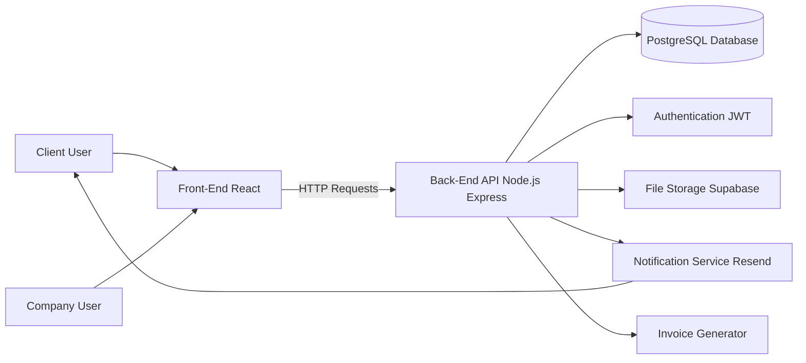
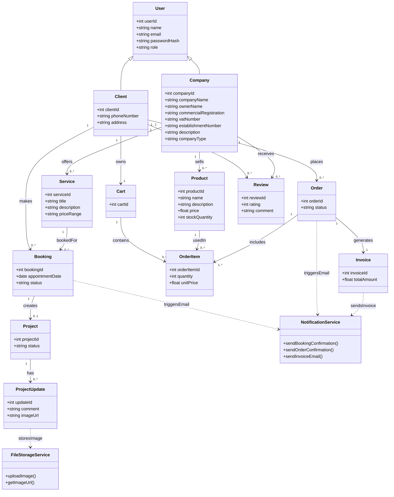
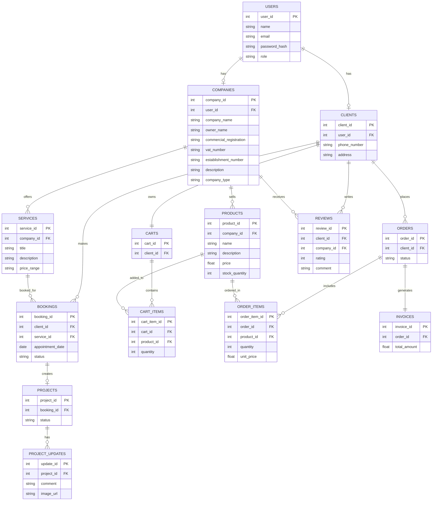
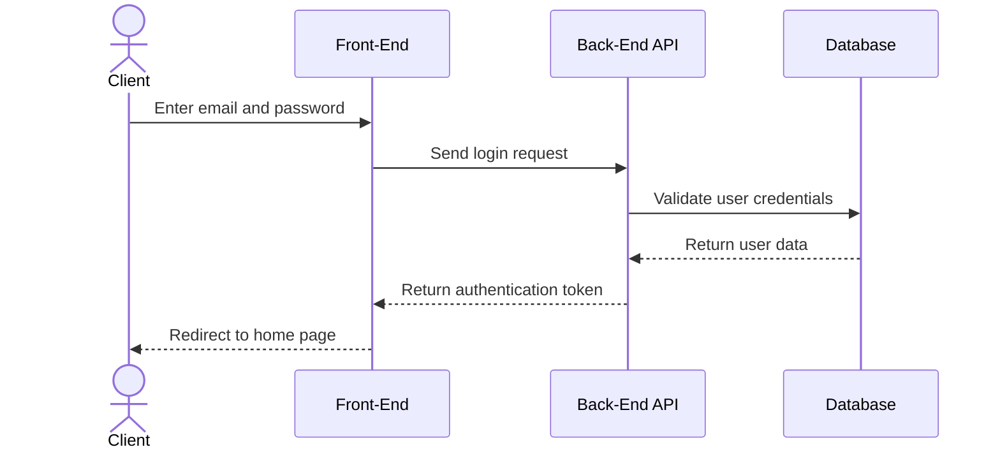
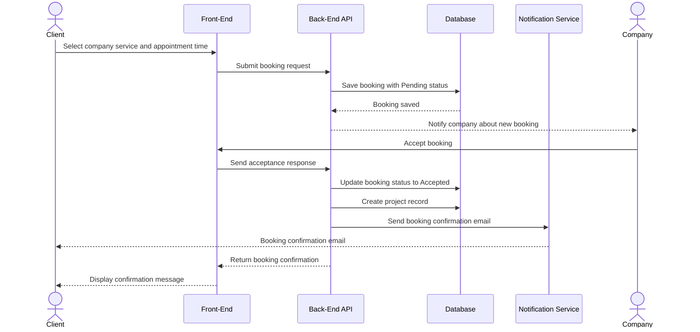
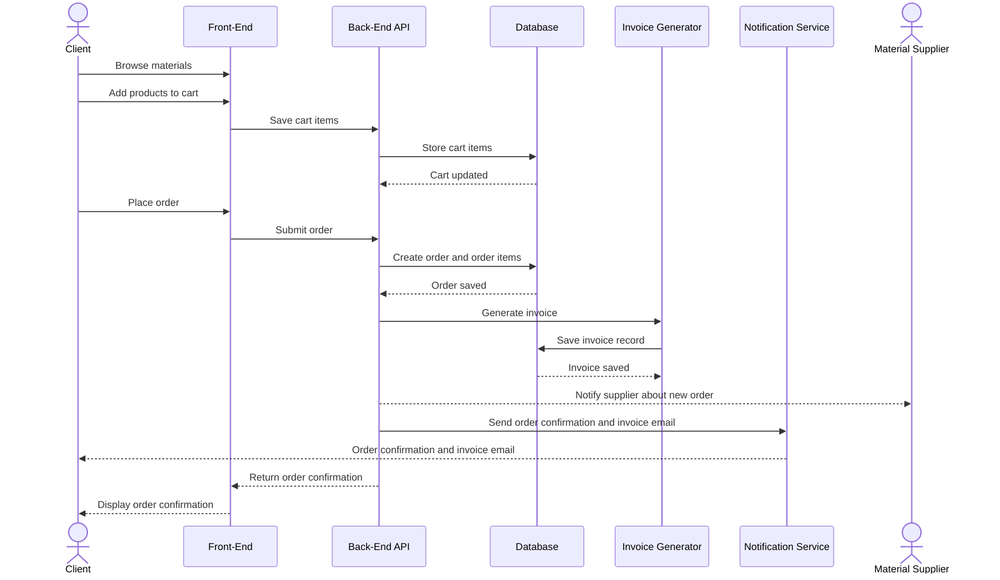

# Stage3 Report - Project: Ammar Platform (عمار) 🏗️

The system supports four main user types:

- Client  
- Full construction companies (from start to turnkey)  
- Partial construction companies (specific phases of the project)  
- Material suppliers (providing building materials)  

---

## User Stories

### Must Have

#### Client

### Account Management

1. As a client, I want to create an account, so that I can access the platform and use its services.  
2. As a client, I want to log in, so that I can access my account securely.  
3. As a client, I want to log out, so that I can protect my account when I am not using it.  
4. As a client, I want to reset my password, so that I can regain access to my account if I forget it.  
5. As a client, I want to edit my account information, so that I can keep my personal details up to date.  
6. As a client, I want to delete my account, so that I can remove my data from the platform if I no longer want to use it. 
### Platform Usage

7. As a client, I want to browse full construction companies, so that I can find companies that build complete projects.  
8. As a client, I want to browse partial construction companies, so that I can find providers for specific project phases.  

9. As a client, I want to browse building materials, so that I can explore available products.  
10. As a client, I want to search for full construction companies, so that I can quickly find suitable providers.  
11. As a client, I want to search for partial construction companies, so that I can quickly find needed services.  
12. As a client, I want to search for Material Suppliers, so that I can quickly find the materials needed.  
13. As a client, I want to view profiles of full construction companies, so that I can evaluate their services, ratings, and details.  
14. As a client, I want to view profiles of partial construction companies, so that I can evaluate their services and ratings.  
15. As a client, I want to view profiles of Material Suppliers, so that I can evaluate their materials and ratings.  
16. As a client, I want to view services offered by full construction companies, so that I can understand what they provide.  
17. As a client, I want to view services offered by partial construction companies, so that I can choose a specific service.  
18. As a client, I want to view material details and prices, so that I can make informed decisions.  
19. As a client, I want to select a service from the full construction companies, so that I can choose what I need for my project.  
20. As a client, I want to select a service from the partial construction companies, so that I can choose what I need for my project.  
21. As a client, I want to select an available appointment time, so that I can schedule the full construction service.  
22. As a client, I want to receive confirmation of my request, so that I know my booking for full construction is accepted.  
23. As a client, I want to track my project progress, so that I can monitor the full construction process.  
24. As a client, I want to view full construction project details, so that I can stay updated.  

25. As a client, I want to select an available appointment time, so that I can schedule the partial construction service.  
26. As a client, I want to receive confirmation of my request, so that I know my booking for partial construction is accepted.  
27. As a client, I want to track my project progress, so that I can monitor the partial construction process.  
28. As a client, I want to view Partial construction project details, so that I can stay updated.  
29. As a client, I want to add materials to the cart, so that I can prepare my order.  
30. As a client, I want to place an order, so that I can request materials.  
31. As a client, I want to receive an invoice via email, so that I have a record of my purchase.  
32. As a client, I want to track my order status, so that I know when it is processed or delivered.  
33. As a client, I want to rate and review a full construction company after completing the service, so that I can share my experience and help other clients make decisions.  
34. As a client, I want to rate and review a partial construction company after the service is completed, so that I can provide feedback on the specific phase of the project.  
35. As a client, I want to rate and review a material supplier after receiving my order, so that I can share feedback on product quality and service.  
### Full Construction Company

#### Account Management

36. As a full construction company, I want to create an account, so that I can access the platform and offer my services.  
37. As a full construction company, I want to log in, so that I can access my account securely.  
38. As a full construction company, I want to log out, so that I can protect my account when not in use.  
39. As a full construction company, I want to reset my password, so that I can regain access if I forget it.  
40. As a full construction company, I want to edit my account information, so that I can keep my details up to date.  
41. As a full construction company, I want to delete my account, so that I can remove my data from the platform if I no longer want to use it.  

#### Platform Usage

42. As a full construction company, I want to create my profile, so that clients can view my services and information.  
43. As a full construction company, I want to update my profile, so that clients can view my services and information.  
44. As a full construction company, I want to delete my profile, so that I can remove my presence from the platform if needed.  
45. As a full construction company, I want to add services, so that clients can see what I offer.  
46. As a full construction company, I want to update services, so that clients can see what I offer.  
47. As a full construction company, I want to delete services, so that I can remove services that I no longer offer  
48. As a full construction company, I want to create a project for the client, so that I can manage and track the work for that service.  
49. As a full construction company, I want to update project details, so that I can keep the project information accurate.  
50. As a full construction company, I want to delete a project, so that I can remove it if it was created by mistake.  
51. As a full construction company, I want to receive booking requests, so that I can manage incoming projects.  
52. As a full construction company, I want to accept booking requests, so that I can control my workload.  
53. As a full construction company, I want to reject booking requests, so that I can control my workload.  
54. As a full construction company, I want to send confirmation emails for booking requests, so that clients are informed about the request status.  
55. As a full construction company, I want to update project status so that clients can track progress.  
56. As a full construction company, I want to add comments to projects, so that I can communicate with clients.  
57. As a full construction company, I want to upload images of the project, so that I can show progress visually.  
### Partial Construction Company

#### Account Management

58. As a Partial construction company, I want to create an account, so that I can access the platform and offer my services.  
59. As a Partial construction company, I want to log in, so that I can access my account securely.  
60. As a Partial construction company, I want to log out, so that I can protect my account when not in use.  
61. As a Partial construction company, I want to reset my password, so that I can regain access if I forget it.  
62. As a Partial construction company, I want to edit my account information, so that I can keep my details up to date.  
63. As a Partial construction company, I want to delete my account, so that I can remove my data from the platform if I no longer want to use it.  

#### Platform Usage

64. As a partial construction company, I want to create my profile, so that clients can view my services and information.  
65. As a partial construction company, I want to update my profile, so that clients can view my services and information.  
66. As a partial construction company, I want to delete my profile, so that I can remove my presence from the platform if needed.  
67. As a partial construction company, I want to add services, so that clients can see what I offer.  
68. As a partial construction company, I want to update services, so that clients can see what I offer.  
69. As a partial construction company, I want to delete services, so that I can remove services that I no longer offer.  
70. As a partial construction company, I want to create a project for the client, so that I can manage and track the work for that service.  
71. As a partial construction company, I want to update project details, so that I can keep the project information accurate.  
72. As a partial construction company, I want to delete a project, so that I can remove it if it was created by mistake.  
73. As a partial construction company, I want to receive booking requests, so that I can manage incoming service tasks.  
74. As a partial construction company, I want to accept booking requests, so that I can control my workload.  
75. As a partial construction company, I want to reject booking requests, so that I can control my workload.  
76. As a partial construction company, I want to send confirmation emails for booking requests, so that clients are informed about the request status.  
77. As a partial construction company, I want to update service status, so that clients can track progress.  
78. As a partial construction company, I want to add comments to services, so that I can communicate with clients.  
79. As a partial construction company, I want to upload images of the service, so that I can show work progress.  
### Material Suppliers

#### Account Management

80. As a Material Suppliers company, I want to create an account, so that I can access the platform and offer my services.  
81. As a Material Suppliers company, I want to log in, so that I can access my account securely.  
82. As a Material Suppliers company, I want to log out, so that I can protect my account when not in use.  
83. As a Material Suppliers company, I want to reset my password, so that I can regain access if I forget it.  
84. As a Material Suppliers company, I want to edit my account information, so that I can keep my details up to date.  
85. As a Material Suppliers company, I want to delete my account, so that I can remove my data from the platform if I no longer want to use it.  

#### Platform Usage

86. As a material supplier, I want to create my profile so that clients can view my company information.  
87. As a material supplier, I want to update my profile, so that clients can view my company information.  
88. As a material supplier, I want to delete my profile, so that I can remove my presence from the platform if needed.  
89. As a material supplier, I want to add products, so that clients can see available materials and prices.  
90. As a material supplier, I want to update products, so that clients can see available materials and prices.  
91. As a material supplier, I want to delete products, so that I can remove products that I no longer offer.  
92. As a material supplier, I want to receive orders, so that I can process customer requests.  
93. As a material supplier, I want to update order status, so that clients know when their order is processed or delivered.  
94. As a material supplier, I want to send an order confirmation email, so that clients are informed about their order details.  

---

## Should Have

### Client

1. As a client, I want to filter and sort companies by rating, price, or category, so that I can find the most suitable option faster.  
2. As a client, I want to view my past and current orders, so that I can track my purchases.  
3. As a client, I want to receive notifications about updates, so that I stay informed.  
### Full Construction Company

4. As a full construction company, I want to upload documents or reports for a project, so that I can document progress and agreements.  
5. As a full construction company, I want to respond to customer reviews, so that I can engage with feedback.  
6. As a full construction company, I want to filter appointments, so that I can manage them efficiently.  

### Partial Construction Company

7. As a partial construction company, I want to upload documents or reports for a project, so that I can document progress and agreements.  
8. As a partial construction company, I want to respond to customer reviews, so that I can engage with feedback.  
9. As a partial construction company, I want to filter appointments, so that I can manage them efficiently.  

### Material Suppliers

10. As a Material Suppliers company, I want to respond to customer reviews, so that I can engage with feedback.  
11. As a Material Suppliers company, I want to filter orders, so that I can manage them efficiently.  

---

## Could Have

### Client

1. As a client, I want to save favorite companies or materials, so that I can access them later.  
2. As a client, I want to write personal notes, so that I can keep track of my ideas or project details.  
3. As a client, I want to see animated project progress, so that I have better visual experience  

### Full Construction Company

4. As a full construction company, I want to view performance insights, so that I can improve my services.  

### Partial Construction Company

5. As a Partial construction company, I want to view performance insights, so that I can improve my services.  

### Material Suppliers

6. As a Material Suppliers company, I want to view performance insights, so that I can improve my Products.  
7. As a Material Suppliers company, I want to receive alerts when material stock is low, so that I can restock on time.  

---

## Wont Have

1. Real-time chats between customers and companies will not be included in the MVP.  
2. Online payment integration will not be included in the MVP.  
3. AI-based recommendation system will not be included in the MVP.  
4. Real-time location tracking will not be included in the MVP.  
## System Architecture: High-level diagram

| Component            | Tool / Technology |
|---------------------|------------------|
| Front-End           | React            |
| Back-End            | Node.js + Express|
| Database            | PostgreSQL       |
| Authentication      | JWT              |
| File Storage        | Supabase Storage |
| Notification Service| Resend API       |
| Invoice Generator   | Backend Module   |
| Version Control     | Git + GitHub     |
| Diagrams            | Mermaid          |


## Components, Classes, and Database Design

### Components Description

**Front-End:** The front-end is the part of the system that users interact with. It allows clients and companies to use the platform, such as browsing companies, booking services, placing orders, and managing their profiles. It sends requests to the back end and displays the returned data to the users.

**Back-End:** The back end is responsible for handling the main logic of the system. It processes requests coming from the front-end, such as login, bookings, orders, and reviews. It also connects with the database, notification service, and file storage to manage the system operations.

**Database:** The database stores all the data in the system, including users, companies, services, bookings, projects, products, orders, invoices, and reviews. It keeps the data organized and ensures relationships between different parts of the system.

**Notification Service:** The notification service is used to send emails to users. It handles sending booking confirmations, order confirmations, and invoice emails. It is separated from the main system to keep the design simple and scalable.

**File Storage Service:** This component is used to store and manage images related to projects. Companies can upload images to show project progress, and the system provides links to display these images on the front end.

**Invoice Generator:** The invoice generator is responsible for creating invoices for material orders. It generates invoice details based on the order and sends them through the notification service. It works independently from payment processing, since payments are handled outside the system.

---

### Classes Description

**User:** The user represents a general account in the system. It stores basic information such as name, email, password, and role. It is used as a base for both clients and companies.

**Client:** The client represents a user who uses the platform to request services or order materials. The client can browse companies, book services, place orders, track progress, and write reviews.

**Company:** The company represents service providers and material suppliers. It stores company information such as type, description, and rating, and allows managing services or products.

**Service:** The service represents a construction service offered by companies. It includes details such as title, description, and price range.

**Booking:** The booking represents a service reservation made by a client. It stores the appointment date and booking status, such as pending or accepted.

**Project:** The project represents the work created after a booking is accepted. It is used to track the overall progress of the construction.

**Project Update:** the project update represents updates added to a project. It includes comments and images that show the progress of the work.

**Product:** The product represents materials provided by suppliers. It includes product information such as name, price, and available quantity.

**Cart:** The cart represents a temporary list of selected products before placing an order. It allows adding and managing items.

**Order:** The order represents a material purchase made by a client. It stores order details and tracks its status.

**Order Item:** The order item represents a specific product inside an order. It includes quantity and price for each product.

**Invoice:** The invoice represents a record created after placing an order. It includes the total amount and serves as a reference for the client.

**Review:** The review represents feedback given by a client to a company. It includes a rating and a comment.

**Notification Service:** The notification service is responsible for sending emails such as booking confirmations, order confirmations, and invoices.

**FileStorageService:** The file storage service is used to upload and store images related to projects. It provides links to display these images in the system.

## Class Diagram






## Sequence Diagrams

### 1. Client Login







# External APIs  
# Internal API Endpoints  

## 1. Authentication APIs  
## 2. User Account APIs  

### External API Purpose

Supabase Storage API Used to upload and store project progress images and documents.  
Resend API Used to send booking confirmations, order confirmations, password reset emails, and invoices.  
JWT Authentication Used to secure login sessions and protect private endpoints.  

---

### Authentication APIs

| URL Path | Method | Input Format | Output Format |
|----------|--------|--------------|---------------|
| /api/auth/register | POST | JSON: name, email, password, role | JSON: created user data |
| /api/auth/login | POST | JSON: email, password | JSON: token, user role |
| /api/auth/logout | POST | Header: token | JSON: success message |
| /api/auth/reset-password | POST | JSON: email | JSON: password reset message |
| /api/auth/update-password | PUT | JSON: newPassword | JSON: success message |

---

### User Account APIs

| URL Path | Method | Input Format | Output Format |
|----------|--------|--------------|---------------|
| /api/users/me | GET | Header: token | JSON: current user profile |
| /api/users/me | PUT | JSON: name, email, phone | JSON: updated user data |
| /api/users/me | DELETE | Header: token | JSON: account deleted message |

---

## 3. Company Profile APIs  

Company types:

```json
{
 "type": "full_construction | partial_construction | material_supplier"
}
```

| URL Path | Method | Input Format | Output Format |
|----------|--------|--------------|---------------|
| /api/companies | GET | Query: type, city, rating, category | JSON: list of companies |
| /api/companies/:id | GET | Path parameter: company id | JSON: company profile |
| /api/companies/profile | POST | JSON: company name, type, description, location | JSON: created company profile |
| /api/companies/profile | PUT | JSON: updated company information | JSON: updated profile |
| /api/companies/profile | DELETE | Header: token | JSON: profile deleted message |

---

## 4. Services APIs  

| URL Path | Method | Input Format | Output Format |
|----------|--------|--------------|---------------|
| /api/services | GET | Query: companyId, type, category | JSON: list of services |
| /api/services/:id | GET | Path parameter: service id | JSON: service details |
| /api/services | POST | JSON: title, description, priceRange, companyId | JSON: created service |
| /api/services/:id | PUT | JSON: updated service data | JSON: updated service |
| /api/services/:id | DELETE | Path parameter: service id | JSON: deleted message |

---

## 5. Booking APIs  

Status example:

```json
{
 "status": "pending | accepted | rejected"
}
```

| URL Path | Method | Input Format | Output Format |
|----------|--------|--------------|---------------|
| /api/bookings | POST | JSON: serviceId, companyId, appointmentDate, notes | JSON: booking request |
| /api/bookings | GET | Header: token | JSON: user bookings |
| /api/bookings/:id | GET | Path parameter: booking id | JSON: booking details |
| /api/bookings/:id/status | PUT | JSON: status | JSON: updated booking status |

---

## 6. Project Tracking APIs  

Project update example:

```json
{
 "comment": "Foundation work has been completed.",
 "images": ["image_url_1", "image_url_2"],
 "progressPercentage": 40
}
```

| URL Path | Method | Input Format | Output Format |
|----------|--------|--------------|---------------|
| /api/projects | GET | Header: token | JSON: list of user projects |
| /api/projects/:id | GET | Path parameter: project id | JSON: project details |
| /api/projects/:id/status | PUT | JSON: status, progressPercentage | JSON: updated project status |
| /api/projects/:id/updates | POST | JSON: comment, images | JSON: new project update |
| /api/projects/:id/updates | GET | Path parameter: project id | JSON: list of project updates |

---

## 7. Product APIs  

| URL Path | Method | Input Format | Output Format |
|----------|--------|--------------|---------------|
| /api/products | GET | Query: supplierId, category, price | JSON: list of products |
| /api/products/:id | GET | Path parameter: product id | JSON: product details |
| /api/products | POST | JSON: name, description, price, quantity, category | JSON: created product |
| /api/products/:id | PUT | JSON: updated product data | JSON: updated product |
| /api/products/:id | DELETE | Path parameter: product id | JSON: deleted message |

---

## 8. Cart APIs  

| URL Path | Method | Input Format | Output Format |
|----------|--------|--------------|---------------|
| /api/cart | GET | Header: token | JSON: cart items |
| /api/cart/items | POST | JSON: productId, quantity | JSON: added cart item |
| /api/cart/items/:id | PUT | JSON: quantity | JSON: updated cart item |
| /api/cart/items/:id | DELETE | Path parameter: cart item id | JSON: removed message |

---

## 9. Order APIs  

Order status example:

```json
{
 "status": "pending | processing | delivered | cancelled"
}
```

| URL Path | Method | Input Format | Output Format |
|----------|--------|--------------|---------------|
| /api/orders | POST | JSON: cartId, deliveryAddress | JSON: created order |
| /api/orders | GET | Header: token | JSON: user orders |
| /api/orders/:id | GET | Path parameter: order id | JSON: order details |
| /api/orders/:id/status | PUT | JSON: status | JSON: updated order status |

---

## 10. Invoice APIs  

| URL Path | Method | Input Format | Output Format |
|----------|--------|--------------|---------------|
| /api/invoices/:orderId | GET | Path parameter: order id | JSON: invoice details |
| /api/invoices/:orderId/send | POST | JSON: email | JSON: invoice sent message |

---

## 11. Review APIs  

| URL Path | Method | Input Format | Output Format |
|----------|--------|--------------|---------------|
| /api/reviews | POST | JSON: companyId, rating, comment | JSON: created review |
| /api/reviews/company/:companyId | GET | Path parameter: company id | JSON: company reviews |
| /api/reviews/:id | PUT | JSON: rating, comment | JSON: updated review |
| /api/reviews/:id | DELETE | Path parameter: review id | JSON: deleted message |
| /api/reviews/:id/reply | POST | JSON: reply | JSON: company reply |

---

## 12. Notification APIs  

| URL Path | Method | Input Format | Output Format |
|----------|--------|--------------|---------------|
| /api/notifications/booking-confirmation | POST | JSON: bookingId, email | JSON: email sent message |
| /api/notifications/order-confirmation | POST | JSON: orderId, email | JSON: email sent message |
| /api/notifications/invoice | POST | JSON: invoiceId, email | JSON: invoice email sent |

---

## 13. File Upload APIs  

Example JSON Response:

```json
{
 "success": true,
 "message": "Request completed successfully",
 "data": {
   "id": 1,
   "status": "accepted"
 }
}
```

| URL Path | Method | Input Format | Output Format |
|----------|--------|--------------|---------------|
| /api/files/upload | POST | FormData: image/document file | JSON: file URL |
| /api/files/project/:projectId | GET | Path parameter: project id | JSON: project files |


# SCM and QA Plans

**SCM Strategy:** The project will use Git as the version control system and GitHub as the remote repository.

---

## Branching Strategy

| Branch      | Purpose |
|------------|--------|
| main        | Stores the final stable version of the project. |
| development | Stores completed features before they are moved to the final version. |
| feature/*   | Used to work on new features separately. |
| bugfix/*    | Used to fix errors or bugs. |

---

## Regular Commits, Code Reviews, and Pull Requests

The team will commit changes regularly with clear messages to track progress and make it easier to understand what has changed.

Before adding any feature to the main project, the developer will create a Pull Request on GitHub. Another team member will review the code to check for errors, readability, and whether the feature works correctly.

After the code is reviewed and approved, it will be merged into the development branch.

---

## Examples of commit messages:

- Add client login page  
- Create booking API endpoint  
- Fix order status update  

---

# QA Strategy

## Testing Strategy

| Testing Type        | Purpose                                   | Example |
|--------------------|-------------------------------------------|--------|
| Unit Testing        | Tests small parts of the system separately. | Test login validation. |
| Integration Testing | Tests how different parts work together.   | Test booking API with the database. |
| API Testing         | Tests the backend endpoints.               | Test /api/bookings using Postman. |
| UI Testing          | Tests the user interface manually.         | Test login, booking, cart, and dashboard pages |

---

## Testing Tools

| Tool                   | Purpose |
|------------------------|--------|
| Jest                   | Used for unit testing JavaScript and Node.js code. |
| Postman                | Used for testing API endpoints manually. |
| React Testing Library  | Used for testing React components. |
| GitHub Actions         | Used to run automated tests before merging code. |

---

## Deployment Pipeline

The project will use two environments: staging and production.

- Staging is used to test the system before releasing it to real users.  
- Production is the final live version of the system  

---

## Deployment Steps

1. The developer pushes the code to GitHub.  
2. A Pull Request is created.  
3. The code is reviewed by another team member.  
4. Tests are run using GitHub Actions.  
5. If the tests pass, the code is merged into the development branch.  
6. The system is deployed to staging for testing.  
7. If everything works correctly in staging, the code is merged into the main branch.  
8. The system is deployed to production.  

## Figma link 
User interface :
https://www.figma.com/design/CnbGUrEngplmlpdRHIIER6/Untitled?node-id=0-1&t=T5S1GwCZeFMke3l7-1
